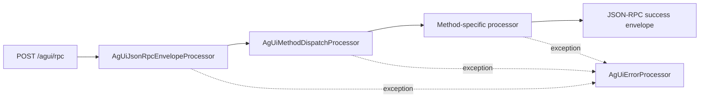

# Architecture

## Overview

The AG-UI project has two layers:

1. `camel-ag-ui-component` reusable endpoint and protocol processors.
2. `samples/ag-ui-yaml-service` runnable runtime exposing HTTP + SSE endpoints.

Sample route definitions are loaded from:

- `samples/ag-ui-yaml-service/src/main/resources/routes/ag-ui-platform.camel.yaml`

Runtime state services can run in two modes:

1. In-memory (`InMemoryAgUiSessionRegistry`, `InMemoryAgUiStateStore`)
2. Persistence-backed (`PersistentAgUiSessionRegistry`, `PersistentAgUiStateStore`) through `camel-persistence` `FlowStateStore` providers

## Request Pipeline



## Streaming Pipeline

```mermaid
flowchart LR
  A[Method processor emits AgUiEvent] --> B[AgUiSessionRegistry]
  B --> C[Event buffer + sequence]
  D[GET /agui/stream/{runId}] --> E[AgUiSseProcessor]
  E --> F[text/event-stream payload]
```

When persistence is enabled (`camel.persistence.enabled=true`), emitted events are also written to the selected backend (`redis` or `jdbc`) and rehydrated on demand.

## Agent Request Extension Hook

`POST /agui/agent` uses the core `agUiAgentRequestProcessor` for methodless run orchestration.

`POST /agui/backend_tool_rendering` is an alias route that uses the same processor chain as `/agui/agent`.

Before `run.text` dispatch, core optionally resolves a processor bean named `agUiAgentPreRunTextProcessor` and executes it.

This keeps core transport/orchestration content-agnostic while allowing samples (or adopters) to attach widget or domain-specific behavior outside the core module.

## Core Runtime Beans

- `agUiJsonRpcEnvelopeProcessor`
- `agUiMethodDispatchProcessor`
- `agUiErrorProcessor`
- `agUiSseProcessor`
- `agUiHealthProcessor`
- `agUiDiagnosticsProcessor`
- `agUiSessionRegistry`
- `agUiStateStore`

## Persistence Bootstrapping

`AgUiComponentApplicationSupport` selects state services based on properties:

- `camel.persistence.enabled=false` (default): in-memory services
- `camel.persistence.enabled=true`: persistent services backed by `FlowStateStoreFactory`

Backend selection:

- `camel.persistence.backend=redis`
- `camel.persistence.backend=jdbc`
