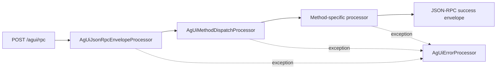

# Architecture

## Overview

The AG-UI project has two layers:

1. `camel-ag-ui-component` reusable endpoint and protocol processors.
2. `samples/ag-ui-yaml-service` runnable runtime exposing HTTP + SSE endpoints.

## Request Pipeline



## Streaming Pipeline

```mermaid
flowchart LR
  A[Method processor emits AgUiEvent] --> B[AgUiSessionRegistry]
  B --> C[In-memory event buffer + sequence]
  D[GET /agui/stream/{runId}] --> E[AgUiSseProcessor]
  E --> F[text/event-stream payload]
```

## Core Runtime Beans

- `agUiJsonRpcEnvelopeProcessor`
- `agUiMethodDispatchProcessor`
- `agUiErrorProcessor`
- `agUiSseProcessor`
- `agUiHealthProcessor`
- `agUiDiagnosticsProcessor`
- `agUiSessionRegistry`
- `agUiStateStore`
